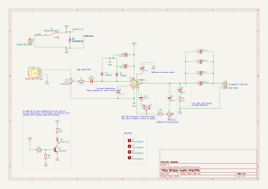
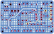

# SIMPLE AUDIO AMPLIFIER

## General Information

- Creator of the project: Filippo Graziani aka Circuitry Passion
- CAD for design: KiCad 9.0.4-9.0.4-0~ubuntu22.04.1, release build

## Revision History

|Version|Date         |Revision Notes|
|-------|-------------|--------------|
|1.1    |Not released |Improved documentation|
|1.0    |Aug. 18, 2025| First release|

## 1 Introduction

This project is an exercise to correctly use KiCad to design a complete project.  
The amplifier consists of the LM386N audio mono amplifier with some circuitry to adjust:

- Gain (incremented with clockwise rotation)
- Volume (incremented with counterclockwise rotation)
- Bass (incremented with counterclockwise rotation)

There is an additional dedicated circuitry to light an LED up when the device is powered on.  
The audio input is jack socket compatible with TRS/TRRS contacts, however only the first ring is actually connected to the amplifier, leaving the second ring unconnected. This means you must set the audio source to output a monophonic sound. The risk is to loose half of the music if stereo is used.

## 2 Technical Specifications

### 1 - INPUT SUPPLY VOLTAGE

The device can operate **from 4 V to 12 V** (compatible with the full voltage range of the LM386N). Suggested input current source **at least 500 mA** (lower is permitted but doesn't guarantee the correct operations for all the conditions).  
The external source must be connected to J1 connector, where the dot sign on the PCB corresponds to the + positive voltage.
Through the S1 swith it is possible to turn on and off the device to avoid unnecessary energy consumption.

### 2 - INPUT AUDIO

This device is compatible with **TRRS and TRS connectors** connected to J2. Monophonic audio source is not mandatory but it is suggested to enjoy the amplifier capabilities.  
At the moment, only the **CTIA/AHJ standard** is supported, be sure to use this kind of device in case of TRRS connector.  

```text
TRS
                                   _______________
  ________  ______  ______________//              ~
 /        ||      ||              ||              ~
 \________||______||______________||              ~
     ^         ^           ^      \\______________~
     |         |           |
LEFT (N.C.)    |           |
             RIGHT         |
                          GND
```

```text
TRRS
                                   _______________
  ________  ______  ______  _____//              ~
 /        ||      ||      ||     ||              ~
 \________||______||______||_____||              ~
     ^         ^       ^      ^  \\______________~
     |         |       |      |
LEFT (N.C.)    |       |      |
             RIGHT     |      |
                      GND     |
                          MIC (N.C)
```

### 3 - OUTPUT AUDIO

The J3 connector must be used to connect the output amplifier to an external speaker, where the dot sign on the PCB corresponds to the + positive voltage.  
Compatible output impedance goes **from 4 Ω to 32 Ω** and higher.  
The typical **output power is 325 mW**.

## Bill of Materials

|Reference   |Qty|Value         |Exclude from BOM |Part number       |
|------------|---|--------------|-----------------|------------------|
|C1,C2,C5,C10|4  |10 uF         |                 |860020672010      |
|C3          |1  |22 uF         |                 |860080672001      |
|C4          |1  |10 uF         |                 |K103K10X7RF5UL2   |
|C6,C9,C12   |3  |0.1 uF        |                 |K104K15X7RF5TL2   |
|C7          |1  |220 uF        |                 |860080675015      |
|C8          |1  |68 nF         |                 |K683K15X7RF5TL2   |
|C11         |1  |33 nF         |                 |K333K15X7RF5TL2   |
|D1,D2       |2  |1N5819        |                 |1N5819            |
|D3          |1  |Green LED     |                 |LTL-307GLC        |
|D4          |1  |NZX13B,133    |                 |  NZX13B,133      |
|H1,H2,H3,H4 |4  |MountingHole  |Excluded from BOM|                  |
|J1,J3       |2  |TB006-508-02BE|                 |TB006-508-02BE    |
|J2          |1  |PJ-322        |                 |PJ-322            |
|Q1          |1  |2N2222A       |                 |2N2222A           |
|R1,R5       |2  |10 K          |                 |MF0207FRE52-10K   |
|R2          |1  |7.5           |                 |MF0207FTE52-7R5   |
|R3          |1  |5.1 K         |                 |MF0207FTE52-5K1   |
|R4          |1  |470           |                 |MFR50SFTE52-470R  |
|R6          |1  |1 K           |                 |MF0207FTE52-1K    |
|RV1,RV3     |2  |10 K          |                 |PDB181-K420K-103B |
|RV2         |1  |2 K           |                 |PDB181-K420K-202A2|
|S1          |1  |500SSP3S1M6QEA|                 |500SSP3S1M6QEA    |
|U1          |1  |LM386N-1      |                 |LM386N-1/NOPB     |

## Schematics



## PCB Layout



## Diagram description

### Input power supply section

The J1 connector must be used to apply the extenal power supply. The switch permits to turn on and turn off the circuit, saving energy.  
The zener diode D4 is used to avoid dangerous overvoltage to be applied to the LM386N, making it operating up to about 14 V.

### LED indicator

The circuit to turn the green LED D3 on consists of the transistor Q1 which make the path conducting. The resistor is selected to apply the right current to the LED, up to 12 V.  
An input voltage below 6 V turns off the LED, but the circuit still works up to above 4 V.
However the LED is appreciable from 7 V and above.

### Input signal section

The signal comes only from one of the rings of the audio jack.  
There is the turnable RV1 potentiometer which regulates the volume. Together with R1 avoid overvoltages applied to the input pin of U1 (it operates up to +400 mV and -400 mV).  
Capacitor C6 with R1 an RV1 is a blocking high-pass filter with cuts the frequencies below 160 Hz if RV1 is bypassed.
Additional protection D1, D2 Schottky diodes guarantee the respect of the input voltage range (this, however, could result in signal distortion).  
Maximum volume if totally left (minimum resistance), while minim volume if totally right (maximum resistance).  
Using the test sinewave at 1 kHz, Vsupply = 9 V, max volume and bass boost, no gain - test at 20 Hz, 500 Hz, 1 kHz, 10 kHz, 20 kHz:

1) With D1 and D2: input signal has distorsion, which is more evident when increasing the signal voltage (that's becaus D1 and D2 starts to operate). Best input performance is in the middle range (500 to 10 kHz), values lower and greater are easily distorted with the same volume level.
2) Without D1 and D2: the sinewave is cleaner at all the frequencies but no input protection is provided - pay attention!

### Amplifier circuit regulation

Pin 2 of U1 should be connected either to GND or to C9, but in the circuit it is selected C9.  
Pin 7 can be optionally connected to C4, but in the circuit it is selected C4 present.
Between pin 1 and pin 8 there is the RV2 potentiometer which regulates the signal gain (theoretically from 20 to 200). Maximum gain if totally right (minimum resistance), while minim gain if totally left (maximum resistance).

### Output signal section

A Zobel network consisting of C8 and R2 creates a low-pass filter which introduces a pole in the output characteristics. Its frequency is 312 kHz, that corresponds to the upper limit of the U1 bandwidth (300 kHz).  
In order to block dangerous DC voltage to the speaker, a 250 µF equivalent capacitor is connected in series with the signal path.  
An additional circuit between pin 5 and pin 1 of U1 is used to regulate the bass boost through the RV3 potentiometer.  
From the tests with an input sinewave, it shows that:

- on one end of the pot (total right, maximum resistance), the peak-to-peak voltage from frequencies above 350 Hz is amplified, while below is reduced;
- on the other end of the pot (total left, minimum resistance), there is the inverted condition, hence there is a little bass boost sacrificing the higher frequencies (350 Hz and higher).

## Notes for future redesign

- Make the input compatible with stereo audio format too, adding a stereo to mono converter (summing OPAMP with double voltage).

- Add more descriptive silkscreen on the PCB.

- Correct the footprints of the capacitors, resistors, LED.

- Move the jack to the potentiometers side.

- Avoid hatched ground, use the entire plane instead.

- Isolate the power supply ground (if possible).

- Test with TRRS connector.

## License

You are free to use, reproduce and modify this project in its entirety.  
Please, remember to refer to me, this would be very appreciated and will help me to continue to do better!
